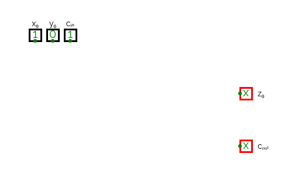
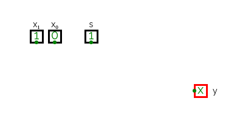
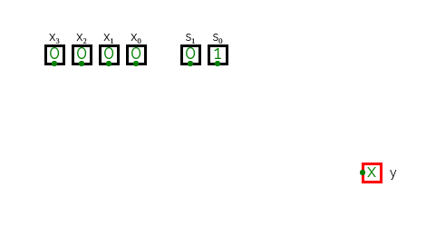
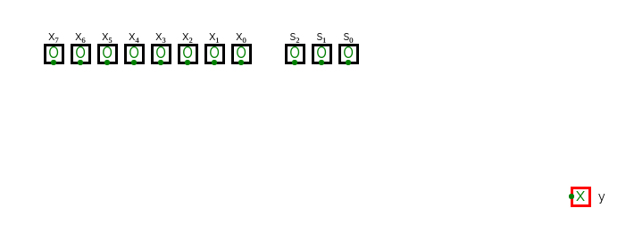
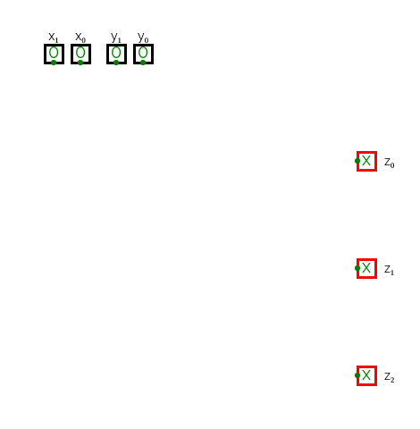
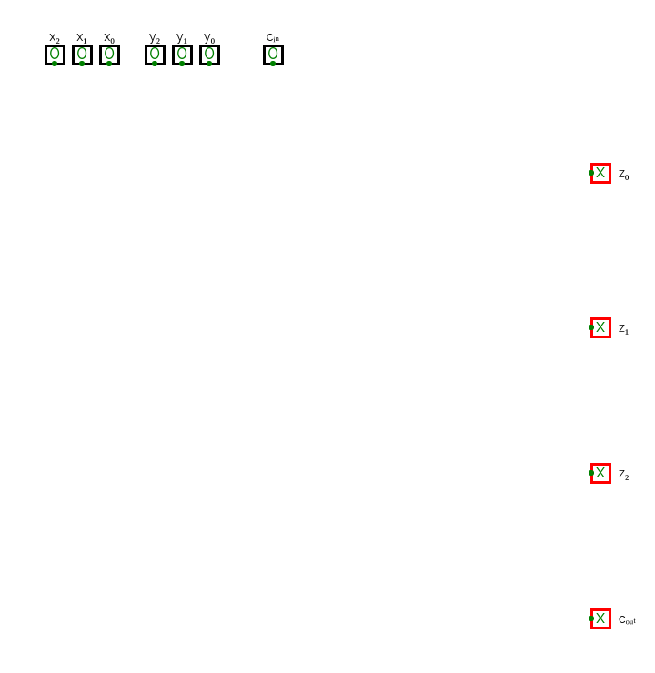

# Praktikum 3

Wir empfehlen Ihnen die Bearbeitung auf Papier und die anschließende Übertragung hierher. Mit dem Visual Studio Code Plugin für "draw.io" können Sie die PNG-Dateien direkt bearbeiten!

von: **Tragen Sie hier Ihren Namen ein**

CircuitVerse Arbeitsbuch: **Fügen Sie hier den Link zu Ihren Schaltungen ein (zu finden auf dem Dashboard->more)** https://circuitverse.cs.hm.edu/users/id/projects/name

**Hinweis zur Notation: Hier wird die Latex Mathematik-Notation verwenden. '\overline' ist die Negation, '\vee' ist die ODER- und '\wedge' die UND- Verknüpfung.**

Vorgehen:

- [ ] Vervollständigen Sie den Namen + Link am Beginn des Dokuments
- [ ] Vervollständigen Sie die Wahrheitstabellen
- [ ] Beachten Sie die Limitierungen der Elemente!
- [ ] Laden Sie die Bilder aus CircuitVerse herunter und ersetzen die Dateien entsprechend. Beachten Sie die verschiedenen Schaltungs-Reiter, jede Schaltung ist separat. Laden Sie die PNG-Datei herunter wie im Wiki beschrieben.

Hinweis: Haken Sie in vorstehender Liste für sich die TODO-Items ab, indem Sie `[ ]` durch `[x]` ersetzen.

## Aufgabe 1

### a) Volladdierer als 2-stufiges Schaltnetz

**Vervollständigen Sie folgende Wahrheitstabelle: Volladdierer**

| $`y_0`$ | $`x_0`$ | $`c_{in}`$ | $`c_{out}`$ | $`z_0`$ |
|:-------:|:-------:|:-------:|:-------:|:-------:|
| 0       | 0       | 0       |         |         |

Schaltung in CircuitVerse: **Ersetzen Sie folgendes Bild durch Ihre Schaltung**

### b) Multiplexer

Schaltung in CircuitVerse: **Ersetzen Sie folgendes Bild durch Ihre Schaltung**

Schaltung in CircuitVerse: **Ersetzen Sie folgendes Bild durch Ihre Schaltung**

Schaltung in CircuitVerse: **Ersetzen Sie folgendes Bild durch Ihre Schaltung**

### c) Zwei 2-bit Addierer mit drei 8:1 Multiplexer

**Vervollständigen Sie folgende Wahrheitstabelle: $`x_1 x_0 + y_1 y_0 = z_2 z_1 z_0`$**

| $`x_1`$ | $`x_0`$ | $`y_1`$ | $`y_0`$ | $`z_2`$ | $`z_1`$ | $`z_0`$ |
|:-------:|:-------:|:-------:|:-------:|:-------:|:-------:|:-------:|
| 0       | 0       | 0       |  0      |         |         |         |

Schaltung in CircuitVerse: **Ersetzen Sie folgendes Bild durch Ihre Schaltung**

## Aufgabe 2: Ripple-Carry Addierer

**Ersetzen Sie folgendes Bild mit Ihrer Lösung**

## Aufgabe 3: Dokumentation des geplanten Tests

